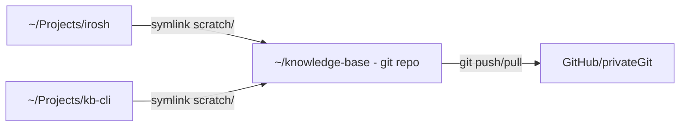

# kb

A cross-platform CLI for managing a private knowledge-base ecosystem.

`kb` wires your project repositories to a single centrally-synced git
repository of "memory" — research, specs, handoffs, and agent rules — via
symlinks. Every project automatically sees its KB directory as `scratch/`, and
the whole memory tree syncs across machines.



## Features

- **One command project wiring** — `kb link` and `kb unlink` create/remove
  the `scratch/` and `.agent-rules/` symlinks, write `kb-rules.md`, and keep
  the repo's `.gitignore` clean. No admin rights needed on modern Windows
  (Developer Mode), automatic on Linux/macOS.
- **Centralized memory** — per-project directories under `projects/<name>/`
  hold `HANDOFF.md`, `research/`, `spec/`, `decisions/`, `plans/`,
  `conclusions/`, `inputs/`, and `ref/`.
- **Session tracking** — `kb work` / `kb done` start and finish a working
  session, committing and pushing only the projects you changed.
- **Selective sync** — `kb subscribe` switches any machine to a
  sparse-checkout that keeps only the projects you care about, in place,
  without re-cloning.
- **Portable migration** — `kb export` packages a project's memory into a
  tarball; `kb import` restores it under any name.
- **Health visibility** — `kb doctor` checks config, symlinks, the global
  gitignore, handoff staleness, orphaned memory, and sparse drift.
- **Shell-native** — completions for bash, zsh, fish, PowerShell, elvish
  (`kb completions`), a man page (`kb man`), and `--json` on every command.

## Requirements

- A POSIX-ish or Windows environment with `git` and `tar` (both ship with
  Windows 10+ and every mainstream Linux/macOS).
- **Windows**: symlink creation needs Developer Mode (Settings → System →
  For developers → Developer Mode) or an elevated shell. See
  [Platform notes](#platform-notes).

## Install

**Unix / macOS:**

```bash
curl -fsSL https://raw.githubusercontent.com/shedrackgodstime/kb-cli/master/install.sh | bash
```

**Windows (PowerShell):**

```powershell
iwr -useb https://raw.githubusercontent.com/shedrackgodstime/kb-cli/master/install.ps1 | iex
```

**From source (requires Rust toolchain):**

```bash
git clone git@github.com:shedrackgodstime/kb-cli.git
cd kb-cli
cargo install --path .
```

Verify: `kb --version`.

## Quick Start

```bash
# 1. One-time setup on a machine: point kb at your knowledge-base repo.
kb init --kb-root ~/knowledge-base

# 2. Wire a project repository to the KB.
cd ~/Projects/my-app
kb link .            # or: kb link my-app

# 3. Health check.
kb doctor

# 4. Start a working session (pulls KB + re-links + tracks the project).
kb work my-app
# ... make changes; write memory under scratch/ ...

# 5. Finish the session: commit + push the projects you worked on.
kb done -m "my-app: add initial architecture notes"
```

You can open project memory directly in your editor:

```bash
kb open my-app       # opens ~/knowledge-base/projects/my-app in $EDITOR
kb open              # opens the knowledge-base root
```

## How It Works

### The knowledge-base repository

A KB is a git repository with at least `AGENTS.md` and `INDEX.md` at its root
(that's what marks a directory as a knowledge-base). It holds one directory
per project:

```
knowledge-base/
├── AGENTS.md              # cross-project agent charter
├── INDEX.md               # project index
├── agent-rules/           # shared rules (may also live in each project)
├── templates/project/     # scaffolding templates
└── projects/<name>/
    ├── HANDOFF.md         # what's running, blockers, next actions
    ├── conclusions/
    ├── decisions/
    ├── inputs/
    ├── plans/
    ├── ref/               # pinned reference repo clones
    ├── research/
    └── spec/
```

### Project wiring

`kb link` creates a symlink `scratch` inside the project repository pointing
at `projects/<name>/` in the KB, plus an `.agent-rules/` symlink, writes a
`kb-rules.md` map in the project, keeps the repository's `.gitignore` clean,
and records the project in `active_projects` in `~/.kb/config.toml`. `kb
unlink` removes the wiring while **keeping** the memory in the KB.

### Sessions

`kb work <project>` is `sync + link + track`: it pulls the KB, wires the
project, and records it as in-progress in `~/.kb/state.toml`. `kb done`
commits the in-progress project's memory and pushes it (`git push -u origin
HEAD`, so it also works on KBs that have never been pushed from this machine).
If the working tree is clean, `kb done` is a no-op that leaves state alone.

## Command Reference

### Global flags

Every command accepts:

| Flag | Meaning |
|---|---|
| `--kb-root <PATH>` | Override knowledge-base root discovery |
| `--json` | Machine-readable JSON output |
| `-v, --verbose` | Verbose output |
| `-q, --quiet` | Suppress informational messages |

### Core setup

| Command | Description |
|---|---|
| `kb init [--kb-root <PATH>]` | One-time machine setup: locate/record the KB, prepare the global gitignore. The wizard guides you to clone or `git init` a KB if none exists. |
| `kb link <project>\|path>` | Wire a project repository to the KB (symlinks, `kb-rules.md`, `.gitignore`, active list). Idempotent. |
| `kb unlink <project>` | Remove a project's symlinks and `kb-rules.md`; memory is kept. |
| `kb archive <project> [--restore]` | Park a project: unlink wiring, move memory into `archive/<name>`, drop it from the active list. `--restore` brings it back under `projects/` (then `kb link <name>` to rewire). |
| `kb status [--all] [--refs]` | Overview of active (or all) projects: memory path, symlink health, handoff age. |
| `kb doctor [--fix]` | Health checks: config, symlinks, global gitignore, handoffs, orphaned memory, sparse drift. `--fix` auto-repairs config/symlinks/gitignore/orphaned/sparse, then shows what remains. |
| `kb projects [--active-only] [--verbose]` | List all projects with active status and handoff info. |

### Daily work

| Command | Description |
|---|---|
| `kb work <project>` | Start a session: pull KB (rebase), link, track as in-progress. |
| `kb done -m <msg>` | Commit in-progress project memory and push it; clears the session. |
| `kb open [project]` | Open project memory (or the KB root) in `$EDITOR`/`$VISUAL`, falling back to the platform file manager. |
| `kb search <query> [--project X] [--files-only] [--glob G] [--case-sensitive]` | Case-insensitive substring search across memory. Exit code 1 when there are no matches. |
| `kb log [-n N] [--project X] [--stat]` | Recent commits from KB git history, path-filtered per project. Default limit 15. |
| `kb rules [project] [--all] [--dry-run]` | Ensure the personal `kb-rules.md` map for a project; `--all` refreshes every configured project. |

### Sync

| Command | Description |
|---|---|
| `kb pull [--project X] [--link\|--no-link]` | Fast-forward pull of KB updates, then re-link active projects. |
| `kb sync [--project X]` | `git pull --rebase` + re-link (specific or all). |
| `kb push --project X [-m msg]` | Commit and push specific projects (plus shared files), repeatable `--project`. |
| `kb global-sync [-m msg] [--no-link] [--dry-run]` | Bidirectional: pull if safe, then commit + push everything. |

### Selective sync (sparse)

| Command | Description |
|---|---|
| `kb subscribe <project> [--dry-run]` | Keep this project's memory on this device only. First subscribe converts the full clone to sparse-checkout **in place** — no re-clone. |
| `kb unsubscribe <project> [--dry-run]` | Stop keeping a project's memory. Removing the **last** subscription restores a full checkout. |

The sparse cone always keeps the always-on top-level KB directories plus one
`projects/<name>/` per subscription, so public files (`INDEX.md`, `AGENTS.md`,
`agent-rules/`) stay available on every device.

### Migration

| Command | Description |
|---|---|
| `kb export <project> [--output <PATH>]` | Package a project's memory into a portable tarball (default `~/<name>.tar.gz`). Requires memory on disk (`kb link` or `kb subscribe` first). |
| `kb import <tarball> [--name <NAME>]` | Restore memory from a tarball under `--name` (or auto-detected). Isolated extraction + rename; never overwrites existing memory. |

Typical migration between machines:

```bash
# Machine A
kb export irosh --output irosh.tar.gz

# Machine B (rename while importing if you like)
kb import irosh.tar.gz --name irosh
kb link irosh
```

### Reference repos

`kb clone-refs [project|--all] [--shallow] [--dry-run] [--force]` clones the
reference repos pinned in a project's `ref/README.md` into `ref/`. Projects
without a `ref/README.md` are skipped. `--force` re-clones when a pinned
revision mismatches; `--shallow` uses depth-1 clones.

### Shell & config

| Command | Description |
|---|---|
| `kb completions <bash\|zsh\|fish\|powershell\|elvish>` | Write `kb.<ext>` in the current directory (install per the printed hint, or use `--json` to get the text embedded in JSON). |
| `kb man [--output <DIR>]` | Write `kb.1` (default: current directory). |
| `kb config list` | Show every configuration value. |
| `kb config get <key>` | Read one dotted key, e.g. `projects.irosh.clone_depth`. |
| `kb config set <key> <value>` | Write a dotted key. Arrays accept a comma-list or JSON; paths accept `~`. |
| `kb config unset <key>` | Reset a key to its default. |

## Configuration

`~/.kb/config.toml`:

```toml
kb_root = "/home/user/knowledge-base"
active_projects = ["irosh", "kb-cli"]

[projects.irosh]
repo_path = "/home/user/Projects/irosh"
clone_depth = 0

[projects.kb-cli]
repo_path = "/home/user/Projects/kb-cli"
```

| Field | Required | Default | Purpose |
|---|---|---|---|
| `kb_root` | yes | — | Absolute path to the knowledge-base repo |
| `active_projects` | no | `[]` | Projects this machine is wired to |
| `projects.<name>.repo_path` | no | `~/Projects/<name>` | Custom project repo location |
| `projects.<name>.clone_depth` | no | `0` | Ref clones: `1` shallow, `0` full |

Prefer `kb config set/get/unset` over hand-editing; the file is re-read on
every invocation.

### Discovery order

When `kb` needs the knowledge-base root:

1. `--kb-root` CLI flag
2. `KB_ROOT` environment variable
3. `kb_root` in `~/.kb/config.toml`
4. Walk up from the current directory looking for `AGENTS.md` + `INDEX.md`

If none are found, `kb` explains how to run `kb init`.

## Multi-Machine Workflow

```bash
# Machine A: start work
kb work dioxus-auth
# ... make changes; write memory under scratch/ ...
kb done -m "auth: fix token refresh"

# Machine B: pick up where A left off
kb work dioxus-auth        # pulls A's memory, links, tracks
kb open dioxus-auth        # read the new HANDOFF
```

A device that only needs a couple of projects uses sparse sync:

```bash
# Machine B: keep only the projects you actually touch.
kb subscribe irosh
kb subscribe kb-cli
# Memory for every other project stays in the repo, off this disk.
```

## JSON Output

Every command supports `--json`. Shapes are stable and documented per
command; the common envelope is `{"ok": true, "data": {...}}` on success and
an error object on failure. Example:

```json
{
  "ok": true,
  "data": {
    "project": "irosh",
    "path": "C:\\Users\\me\\knowledge-base\\projects\\irosh"
  }
}
```

## Shell Completions

```bash
kb completions bash > ~/.local/share/bash-completion/completions/kb
kb completions zsh  > ~/.zsh/completions/_kb
kb completions fish > ~/.config/fish/completions/kb.fish
# PowerShell
kb completions powershell | Out-String | Invoke-Expression
```

## Platform Notes

- **Windows** — symlinks require Developer Mode or an elevated shell; without
  it, `kb link` fails with a privilege error. Paths from git may display with
  a `\\?\` prefix; that is cosmetic normalizing.
- **Android / Termux** — supported (`aarch64` + `x86_64`); `xdg-open` is used
  for `kb open` and the standard POSIX tools apply.
- **Editor selection** — `$VISUAL` wins over `$EDITOR` for `kb open`. Values
  may include leading arguments (`powershell -NoProfile -File hook.ps1`). The
  editor runs with inherited stdio and `kb` waits for it to exit; with no
  editor set, the platform file manager opens the directory and returns
  immediately.
- **PowerShell 5.1** — the interactive shell strips inner quotes from native
  arguments, so pass array values to `kb config set` as a comma-list or use
  `--%`.

## Development

```text
kb-cli/
├── crates/
│   ├── kb-core/   # library: config, paths, discovery, platform abstractions
│   └── kb-cli/    # binary: argument parsing, command dispatch, output
└── install.sh, install.ps1
```

```bash
cargo build -p kb-core -p kb
cargo test --workspace          # unit + integration suite
cargo clippy --workspace --all-targets
cargo fmt --check
```

The validation gate before release is: full test suite green, zero clippy
warnings, `cargo fmt` clean.

## License

MIT